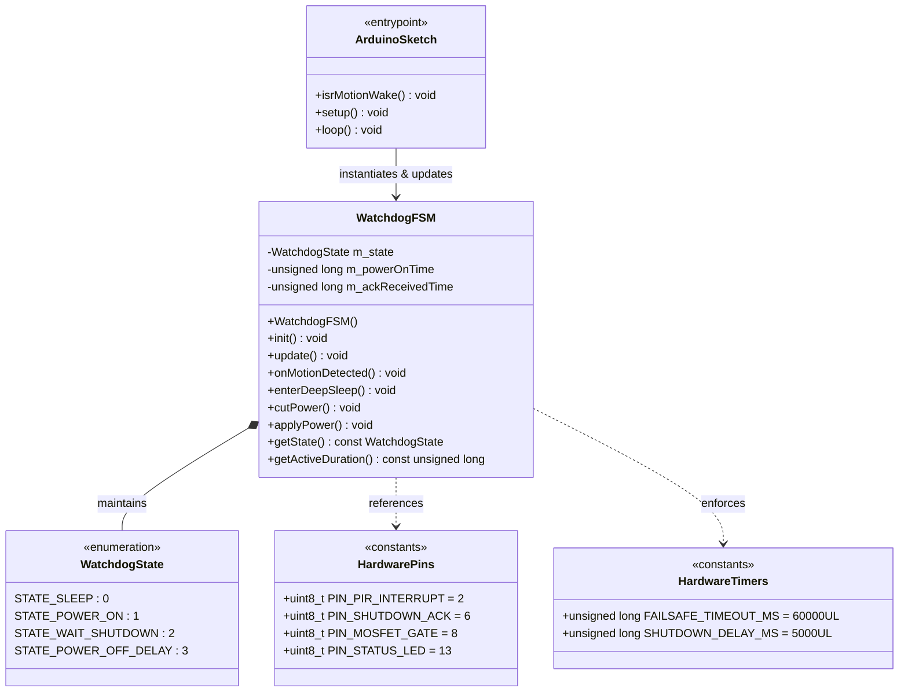
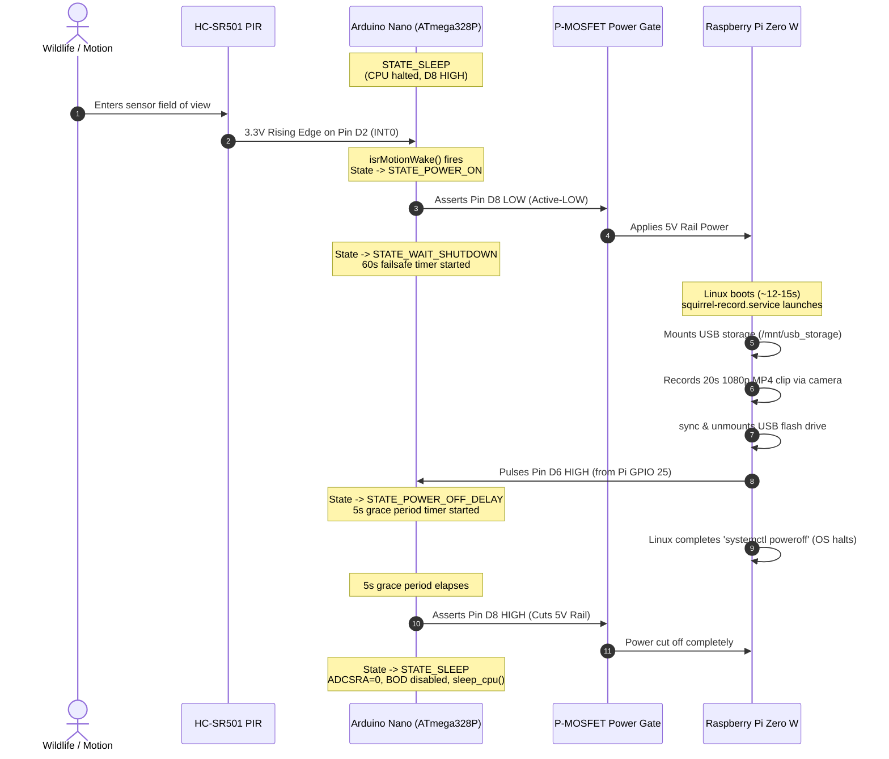

# Arduino Nano Watchdog Node: Architecture & Behavior

This document provides a detailed explanation of the firmware execution lifecycle, state transitions, hardware signal interactions, and power-saving mechanisms for the **Arduino Nano V3.0 Watchdog Node** located in [`Arduino_Nano/`](file:///Users/davidkester/Workspace/SquirrelFeeder/Arduino_Nano).

---

## 1. Executive Summary & System Role

The **Arduino Nano V3.0** (ATmega328P, 5V, 16 MHz) acts as the autonomous **power arbiter and watchdog** for the entire edge system. Because a Linux-based single-board computer (Raspberry Pi Zero W) draws between 150 mA and 250 mA even when idling, leaving it powered 24/7 would rapidly exhaust a battery. 

The Arduino Nano solves this problem:
1. It remains in an ultra-low-power sleep state (`SLEEP_MODE_PWR_DOWN`) consuming microamps.
2. It wakes instantly via an external hardware interrupt when the PIR sensor detects motion.
3. It switches regulated 5V power to the Raspberry Pi Zero W via a high-side P-channel MOSFET.
4. It listens for a shutdown acknowledgment pulse from the Pi once recording and filesystem flush are complete.
5. It enforces a strict **60-second hardware failsafe timer** to cut power if the Linux operating system ever freezes, hangs, or crashes.
6. It grants a **5-second grace window** for disk buffers to unmount before cleanly isolating power and returning to deep sleep.

---

## 2. Hardware Pinout & Signal Mapping

| Pin | Constant Name | Direction | Signal Type | Description |
| :--- | :--- | :--- | :--- | :--- |
| **`D2`** | `PIN_PIR_INTERRUPT` | `INPUT` | Active-HIGH 3.3V pulse (`INT0`) | External interrupt line triggered by HC-SR501 PIR sensor on motion detection. |
| **`D6`** | `PIN_SHUTDOWN_ACK` | `INPUT` | Active-HIGH 3.3V pulse | Handshake input from Pi Zero W (`GPIO 25`) signaling video recording is saved and OS is halting. |
| **`D8`** | `PIN_MOSFET_GATE` | `OUTPUT` | Active-LOW logic (5V / 0V) | Controls the high-side P-Channel MOSFET. `LOW` = Power ON to Pi; `HIGH` = Power Cut OFF. |
| **`D13`**| `PIN_STATUS_LED` | `OUTPUT` | Active-HIGH | Onboard LED indicator. Lit when Pi is energized; unlit during sleep. |

---

## 3. UML Architecture & Class Diagram

The Watchdog firmware is organized as an Object-Oriented finite state machine where hardware registers, I/O pin mappings, and lifecycle timing are decoupled into cohesive abstractions:



---

## 4. Finite State Machine (FSM) Workflow & State Diagram

The core behavior is implemented as a deterministic finite state machine defined in [`WatchdogFSM.h`](file:///Users/davidkester/Workspace/SquirrelFeeder/Arduino_Nano/include/WatchdogFSM.h) and [`WatchdogFSM.cpp`](file:///Users/davidkester/Workspace/SquirrelFeeder/Arduino_Nano/src/WatchdogFSM.cpp).

### FSM State Diagram

```mermaid
stateDiagram-v2
    [*] --> STATE_SLEEP: WatchdogFSM::init()

    STATE_SLEEP --> STATE_POWER_ON: Motion Interrupt (D2 RISING / INT0)
    note right of STATE_SLEEP
      - ADC Disabled
      - BOD Disabled
      - CPU Halted (SLEEP_MODE_PWR_DOWN)
      - D8 = HIGH (Pi Power OFF)
      - D13 = LOW (LED OFF)
    end note

    STATE_POWER_ON --> STATE_WAIT_SHUTDOWN: Immediate Transition
    note right of STATE_POWER_ON
      - D8 = LOW (MOSFET Gate Saturated -> Pi Boots)
      - D13 = HIGH (LED ON)
      - m_powerOnTime = millis()
    end note

    STATE_WAIT_SHUTDOWN --> STATE_POWER_OFF_DELAY: D6 == HIGH (Pi Shutdown ACK)
    STATE_WAIT_SHUTDOWN --> STATE_SLEEP: Timeout >= 60,000 ms (Hardware Failsafe)
    note right of STATE_WAIT_SHUTDOWN
      - Monitors D6 from Pi GPIO 25
      - Tracks active elapsed runtime
      - Failsafe cuts power if OS hangs
    end note

    STATE_POWER_OFF_DELAY --> STATE_SLEEP: Elapsed >= 5,000 ms (OS Halt Margin)
    note right of STATE_POWER_OFF_DELAY
      - Gives Linux 5s to sync disks & halt CPU
      - Calls cutPower() -> D8 = HIGH, D13 = LOW
    end note
```

---

## 5. End-to-End System Sequence Diagram

This sequence diagram illustrates the physical timing and interactions between the components across a complete detection, recording, and shutdown cycle:



---

## 6. Detailed State Breakdown

### `STATE_SLEEP` (0)
- **Entry Conditions:** Initial power-up during `init()`, after graceful shutdown delay, or upon 60-second failsafe expiry.
- **Power Consumption:** Drops ATmega328P consumption from ~15 mA down to microamps by shutting down internal sub-modules:
  - Analog-to-Digital Converter disabled (`ADCSRA = 0`), saving ~200 µA.
  - Brown-Out Detector disabled during sleep (`sleep_bod_disable()`), saving ~25 µA.
  - Sleep mode set to `SLEEP_MODE_PWR_DOWN`.
- **Interrupt Handling:** Global interrupts are enabled (`sei()`) and the CPU halts via `sleep_cpu()`.
- **Wake Trigger:** A rising edge on Pin `D2` invokes the Interrupt Service Routine (`isrMotionWake()`), which calls `WatchdogFSM::onMotionDetected()`.
- **Exit Condition:** If `m_state == STATE_SLEEP`, state transitions to `STATE_POWER_ON`.

### `STATE_POWER_ON` (1)
- **Actions Performed:**
  - Calls `applyPower()`:
    - Writes `PIN_MOSFET_GATE` (`D8`) to `LOW`. This grounds the P-MOSFET gate, causing current to flow from the 5V power supply to the Raspberry Pi.
    - Writes `PIN_STATUS_LED` (`D13`) to `HIGH` for physical visual feedback.
  - Captures boot timestamp: `m_powerOnTime = millis()`.
  - Transitions immediately to `STATE_WAIT_SHUTDOWN`.

### `STATE_WAIT_SHUTDOWN` (2)
- **Monitoring Loop:** Evaluated on every iteration of `watchdog.update()`.
- **Branch A — Graceful Handshake:**
  - Polls `PIN_SHUTDOWN_ACK` (`D6`).
  - When the Pi asserts `HIGH` (3.3V from GPIO 25), the Nano acknowledges the impending shutdown.
  - Captures acknowledgment timestamp: `m_ackReceivedTime = millis()`.
  - Transitions to `STATE_POWER_OFF_DELAY`.
- **Branch B — Hardware Failsafe Protection:**
  - Evaluates `(millis() - m_powerOnTime) >= FAILSAFE_TIMEOUT_MS` (60,000 ms).
  - If the Raspberry Pi fails to boot, encounters kernel panic, suffers SD card corruption, or hangs, the timer trips.
  - Calls `cutPower()` immediately (`D8` set to `HIGH`, `D13` set to `LOW`).
  - Returns directly to `STATE_SLEEP`, protecting the battery against total drain.

### `STATE_POWER_OFF_DELAY` (3)
- **Grace Window:** 5,000 ms (`SHUTDOWN_DELAY_MS`).
- **Rationale:** When the Raspberry Pi Python script signals shutdown, the Linux kernel still requires a few seconds to flush write caches, unmount the root filesystem, and reach the final processor `halt` state. Cutting power prematurely would corrupt the SD card.
- **Completion:** Once 5 seconds have elapsed since ACK receipt:
  - Calls `cutPower()`: sets `PIN_MOSFET_GATE` (`D8`) to `HIGH` (isolating the Pi) and turns off the status LED.
  - Transitions state to `STATE_SLEEP`.

---

## 7. Code Structure & Implementation Files

```text
Arduino_Nano/
├── Arduino_Nano.ino              # Main Arduino sketch (setup, loop, ISR binding)
├── include/
│   ├── ArduinoMock.h             # Host-side mock environment for non-hardware CI testing
│   └── WatchdogFSM.h             # Class declarations, pin assignments, state enums
├── src/
│   └── WatchdogFSM.cpp           # Finite State Machine implementation & sleep logic
├── integ_test_scripts/
│   ├── test_pir_sensor.ino       # Standalone firmware to validate PIR sensitivity on hardware
│   └── test_pir_integration.py   # Serial test harness for automated PIR testing
└── tests/
    ├── Arduino_Unit_Test_README.md # Guide explaining the host-based C++ unit test runner
    ├── test_pir_integration_script.py # Unit tests for the test harness
    └── test_watchdog_fsm.cpp     # Host-executable C++17 unit tests verifying FSM logic
```

### Sketch Lifecycle (`Arduino_Nano.ino`)
```cpp
#include "include/WatchdogFSM.h"

WatchdogFSM watchdog;

void isrMotionWake() {
    // External hardware interrupt service routine for PIR motion detection (Pin D2 / INT0)
    watchdog.onMotionDetected();
}

void setup() {
    // Initialize pin modes, default power gate off, and prepare sleep
    watchdog.init();

    // Attach INT0 interrupt on RISING edge from HC-SR501 PIR sensor
    attachInterrupt(digitalPinToInterrupt(PIN_PIR_INTERRUPT), isrMotionWake, RISING);
}

void loop() {
    // Execute finite state machine tick
    watchdog.update();
}
```

---

## 8. Testing & Verification

The firmware is designed with testability at its core:
1. **Host-Side Unit Tests (No Arduino Required):**
   Using `ArduinoMock.h`, all state transitions, timers, failsafes, and pin outputs are compiled and tested using native host C++17 compilers (`g++` or `clang++`):
   ```bash
   g++ -std=c++17 -DUNIT_TEST -I Arduino_Nano/include \
       Arduino_Nano/src/WatchdogFSM.cpp Arduino_Nano/tests/test_watchdog_fsm.cpp \
       -o test_runner && ./test_runner
   ```
2. **Physical Integration Testing:**
   Using [`test_pir_sensor.ino`](file:///Users/davidkester/Workspace/SquirrelFeeder/Arduino_Nano/integ_test_scripts/test_pir_sensor.ino) and [`test_pir_integration.py`](file:///Users/davidkester/Workspace/SquirrelFeeder/Arduino_Nano/integ_test_scripts/test_pir_integration.py), developers can connect the physical Nano and PIR sensor via USB serial to calibrate trigger sensitivity and verify hardware interrupt timing before connecting the Raspberry Pi.
