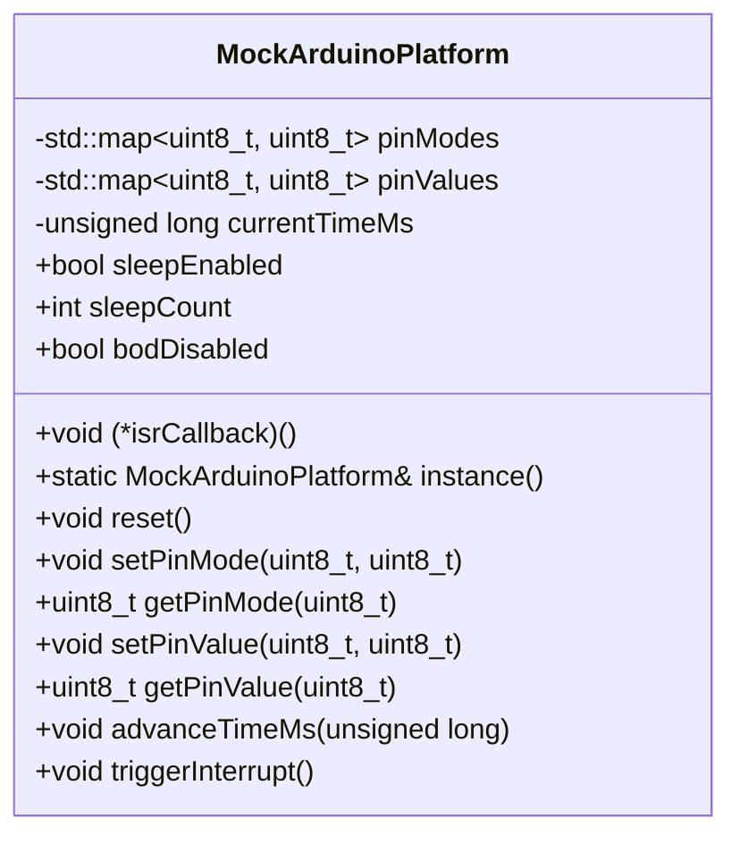

# Hardware-Independent Unit Testing Architecture

This document provides a comprehensive technical explanation of how the unit test suites in [`Arduino_Nano/tests`](Arduino_Nano/tests) execute on a host machine (macOS, Linux, CI/CD runners) without requiring physical connection to an Arduino Nano, ATmega328P microcontroller, PIR sensors, MOSFET circuits, or serial cables.

---

## 1. Executive Summary & Architectural Overview

In traditional embedded development, verification often suffers from the **hardware dependency bottleneck**:

- Flashing firmware over ISP/UART requires physical hardware connected to specific bench setups.
- Real-time delays (such as a 60-second failsafe timeout or 5-second shutdown grace period) cause test suites to run slowly and unreliably.
- Physical peripherals (PIR pyroelectric sensors, power gates, power supplies) introduce environmental noise, settling periods, and non-deterministic state.

To solve this, the **SquirrelFeeder** project separates embedded business logic from underlying hardware silicon. The unit tests run entirely within host memory at native CPU speeds, executing multi-minute hardware scenarios in milliseconds.

```
+-----------------------------------------------------------------------------------------+
|                                HOST TESTING ENVIRONMENT                                 |
|                                                                                         |
|  +-----------------------------------+          +------------------------------------+  |
|  |     Unit Test Suite (Host C++)    |          |    Python Harness Tests (PyTest)   |  |
|  |     [test_watchdog_fsm.cpp]       |          |   [test_pir_integration_script.py] |  |
|  +-----------------+-----------------+          +-----------------+------------------+  |
|                    |                                              |                     |
|                    v                                              v                     |
|  +-----------------------------------+          +------------------------------------+  |
|  |   Core Domain / Business Logic    |          |       Integration Test Runner      |  |
|  |        [WatchdogFSM.cpp]          |          |      [test_pir_integration.py]     |  |
|  +-----------------+-----------------+          +-----------------+------------------+  |
|                    |                                              |                     |
|                    v (-DUNIT_TEST)                                v                     |
|  +-----------------------------------+          +------------------------------------+  |
|  |  Hardware Abstraction Shim (HAL)  |          |         Serial Test Double         |  |
|  |          [ArduinoMock.h]          |          |        [MockArduinoSerial]         |  |
|  |     (MockArduinoPlatform)         |          |                                    |  |
|  +-----------------------------------+          +------------------------------------+  |
|                    |                                              |                     |
|                    v                                              v                     |
|  +-----------------------------------+          +------------------------------------+  |
|  |      Virtual State Registers      |          |       Simulated In-Memory UART     |  |
|  |  • Pin directions & logic states  |          |  • PING -> [PONG] handshake        |  |
|  |  • Virtual time tick counter      |          |  • Sensor warm-up bypass queues    |  |
|  |  • Sleep modes & interrupt vectors|          |  • Virtual trigger event sequences |  |
|  +-----------------------------------+          +------------------------------------+  |
+-----------------------------------------------------------------------------------------+
```

---

## 2. The C++ Firmware Unit Test Harness (`test_watchdog_fsm.cpp`)

The embedded watchdog firmware test harness executes against [`WatchdogFSM.cpp`](Arduino_Nano/src/WatchdogFSM.cpp) using a host C++ compiler (`clang++` or `g++`).

### 2.1 Decoupled Platform Build via Preprocessor Switches

In production, Arduino code compiles with the `avr-gcc` toolchain for the 8-bit Microchip ATmega328P target architecture, relying on `<Arduino.h>`, `<avr/sleep.h>`, and direct hardware registers (e.g., `ADCSRA`).

In [`WatchdogFSM.h`](Arduino_Nano/include/WatchdogFSM.h#L6-L13), header inclusion is conditionally branched via the `UNIT_TEST` macro:

```cpp
#ifdef UNIT_TEST
#include "ArduinoMock.h"
#else
#include <Arduino.h>
#include <avr/sleep.h>
#include <avr/power.h>
#include <avr/interrupt.h>
#endif
```

When compiled with `-DUNIT_TEST`, the host compiler substitutes the AVR toolchain headers with the lightweight mock shim [`ArduinoMock.h`](SquirrelFeeder/Arduino_Nano/include/ArduinoMock.h).

Similarly, hardware-specific sleep register manipulations in [`WatchdogFSM.cpp`](SquirrelFeeder/Arduino_Nano/src/WatchdogFSM.cpp#L38-L64) are guarded so that low-level AVR registers (`ADCSRA = 0`, `sei()`) are only touched when compiling for real silicon:

```cpp
void WatchdogFSM::enterDeepSleep() {
#ifndef UNIT_TEST
    ADCSRA = 0;                          // Disable ADC on AVR
    set_sleep_mode(SLEEP_MODE_PWR_DOWN);
    sleep_enable();
    sleep_bod_disable();                 // Brown-Out Detector disable
    sei();                               // Enable global interrupts
    sleep_cpu();
    sleep_disable();
#else
    // Simulated path recorded by MockArduinoPlatform
    sleep_enable();
    sleep_bod_disable();
    sleep_cpu();
    sleep_disable();
#endif
}
```

---

### 2.2 Hardware Abstraction Layer (HAL) & Shim Functions

Microcontroller sketches call global functions like `pinMode()`, `digitalWrite()`, `digitalRead()`, `millis()`, and `attachInterrupt()`.

[`ArduinoMock.h`](SquirrelFeeder/Arduino_Nano/include/ArduinoMock.h#L121-L180) provides inline C++ replacements for the standard Arduino C-runtime API. Each function routes directly to an in-memory simulation singleton:

```cpp
inline void pinMode(uint8_t pin, uint8_t mode) {
    MockArduinoPlatform::instance().setPinMode(pin, mode);
}

inline void digitalWrite(uint8_t pin, uint8_t val) {
    MockArduinoPlatform::instance().setPinValue(pin, val);
}

inline uint8_t digitalRead(uint8_t pin) {
    return MockArduinoPlatform::instance().getPinValue(pin);
}

inline unsigned long millis() {
    return MockArduinoPlatform::instance().getTimeMs();
}
```

Because function signatures and constants (`LOW`, `HIGH`, `INPUT`, `OUTPUT`) match the official Arduino SDK, **the production source code under test requires zero modifications or test-specific wrappers**.

---

### 2.3 The Mock Platform State Machine (`MockArduinoPlatform`)

[`MockArduinoPlatform`](SquirrelFeeder/Arduino_Nano/include/ArduinoMock.h#L42-L119) acts as an in-memory emulator of the microcontroller peripheral state:

- **Pin Direction Table**: `std::map<uint8_t, uint8_t> pinModes`
- **Pin Voltage Table**: `std::map<uint8_t, uint8_t> pinValues`
- **Virtual Clock**: `unsigned long currentTimeMs`
- **Power & Sleep Registers**: `sleepEnabled`, `sleepCount`, `lastSleepMode`, `bodDisabled`
- **Interrupt Vector Table**: `interruptAttached`, `interruptPin`, `interruptMode`, `isrCallback`



---

### 2.4 Virtual Clock & "Time-Travel" Testing

One of the greatest challenges in embedded testing is validating long-running hardware timers. For example, [`WatchdogFSM.h`](SquirrelFeeder/Arduino_Nano/include/WatchdogFSM.h#L21-L24) defines:

- A **60,000 ms (60-second) failsafe timeout** (`FAILSAFE_TIMEOUT_MS`) to force-cut power if the Raspberry Pi hangs.
- A **5,000 ms (5-second) shutdown delay** (`SHUTDOWN_DELAY_MS`) to allow the Linux kernel to cleanly unmount disk storage before power is removed.

Waiting 65 seconds in real time per test run would make testing slow and prohibitive.

[`MockArduinoPlatform`](SquirrelFeeder/Arduino_Nano/include/ArduinoMock.h#L91-L93) provides the `advanceTimeMs()` method:

```cpp
void advanceTimeMs(unsigned long ms) {
    currentTimeMs += ms;
}
```

In [`test_watchdog_fsm.cpp`](SquirrelFeeder/Arduino_Nano/tests/test_watchdog_fsm.cpp#L78-L96), boundary value tests execute instantaneously:

```cpp
// 1. Advance to 59,000 ms (just before failsafe timeout)
MockArduinoPlatform::instance().advanceTimeMs(59000);
fsm.update();
run_test("Power still ON at 59 seconds", MockArduinoPlatform::instance().getPinValue(PIN_MOSFET_GATE) == LOW);
run_test("Still in STATE_WAIT_SHUTDOWN at 59s", fsm.getState() == WatchdogState::STATE_WAIT_SHUTDOWN);

// 2. Advance another 1,001 ms (exceeding the 60,000 ms limit)
MockArduinoPlatform::instance().advanceTimeMs(1001);
fsm.update();
run_test("Failsafe triggers: D8 HIGH (Power cut)", MockArduinoPlatform::instance().getPinValue(PIN_MOSFET_GATE) == HIGH);
run_test("Returns to STATE_SLEEP after timeout", fsm.getState() == WatchdogState::STATE_SLEEP);
```

This achieves **deterministic, zero-latency timing verification** with single-millisecond precision.

---

### 2.5 Active-Low Inverted Logic Verification

The physical circuit uses an external P-channel MOSFET gate on pin `D8` to control the 5V power rail to the Raspberry Pi Zero W:

- **`D8 = HIGH` (3.3V/5V):** P-MOSFET is cut off $\rightarrow$ **Raspberry Pi Power OFF**.
- **`D8 = LOW` (GND):** P-MOSFET gate is saturated $\rightarrow$ **Raspberry Pi Power ON**.

Because inverted logic introduces a risk of human error during development, the unit test suite explicitly verifies the safety invariants:

1. **Boot Safety Invariant:** Pin `D8` must immediately initialize to `OUTPUT` and `HIGH` to prevent the Pi from accidentally booting or browning out during Nano startup.
2. **Motion Activation:** Triggering motion pulls `D8` to `LOW`.
3. **Graceful Shutdown:** Receiving acknowledgment on `D6` keeps `D8` `LOW` for the duration of `SHUTDOWN_DELAY_MS` (5000 ms) and only releases `D8` to `HIGH` once the delay expires.

---

## 3. The Python Integration Script Test Harness (`test_pir_integration_script.py`)

In addition to firmware state machine tests, [`test_pir_integration_script.py`](SquirrelFeeder/Arduino_Nano/tests/test_pir_integration_script.py) tests the diagnostic integration tool [`test_pir_integration.py`](SquirrelFeeder/Arduino_Nano/integ_test_scripts/test_pir_integration.py) without needing a live USB serial port or physical PIR sensor.

### 3.1 Serial Port Emulation (`MockArduinoSerial`)

[`MockArduinoSerial`](SquirrelFeeder/Arduino_Nano/integ_test_scripts/test_pir_integration.py#L120-L165) provides a duck-typed replacement for `serial.Serial`:

- Simulates the bidirectional ASCII serial protocol.
- Intercepts commands (`PING`, `SKIP`, `STATUS`, `RESET`) and returns predefined responses (`[PONG]`, `[WARMUP_SKIPPED]`, etc.).
- Simulates realistic sensor states (quiescent zero-trigger baseline vs active interrupt trigger events) via internal state queues.

### 3.2 Host-Side Simulation via `--dry-run`

The integration test runner supports a `--dry-run` flag:

```bash
python3 Arduino_Nano/integ_test_scripts/test_pir_integration.py --dry-run --skip-warmup
```

This enables full end-to-end execution of the hardware verification pipeline on local developer machines or CI servers where `/dev/ttyUSB*` or `/dev/cu.usbserial*` devices are absent.

---

## 4. Key Software Design Patterns

| Design Pattern | Implementation in Codebase | Purpose & Benefit |
| :--- | :--- | :--- |
| **Hardware Abstraction Layer (HAL) / Shim** | [`ArduinoMock.h`](SquirrelFeeder/Arduino_Nano/include/ArduinoMock.h) | Replaces target microcontroller peripheral APIs with host-compatible C++ functions, avoiding alterations to production firmware logic. |
| **Singleton Pattern** | [`MockArduinoPlatform::instance()`](SquirrelFeeder/Arduino_Nano/include/ArduinoMock.h#L44-L47) | Implements Meyer's thread-safe local static singleton to provide a centralized virtual hardware state across all test translation units. |
| **Finite State Machine (FSM)** | [`WatchdogFSM`](SquirrelFeeder/Arduino_Nano/include/WatchdogFSM.h#L25-L54) | Strictly decouples hardware inputs (PIR interrupt, Pi ACK) and outputs (MOSFET gate, Status LED) into well-defined discrete states (`STATE_SLEEP`, `STATE_POWER_ON`, `STATE_WAIT_SHUTDOWN`, `STATE_POWER_OFF_DELAY`). |
| **Test Double / Mock Object** | [`MockArduinoSerial`](SquirrelFeeder/Arduino_Nano/integ_test_scripts/test_pir_integration.py#L120-L165) | Replaces physical UART communication with an in-memory queue to validate host-side CLI scripts. |
| **Virtual Clock / Time-Traveler** | `advanceTimeMs()` in [`MockArduinoPlatform`](SquirrelFeeder/Arduino_Nano/include/ArduinoMock.h#L91-L93) | Replaces wall-clock physical waiting with immediate programmatic clock advancement for deterministic and instantaneous test execution. |
| **Inversion of Control (IoC)** | [`Arduino_Nano.ino`](SquirrelFeeder/Arduino_Nano/Arduino_Nano.ino#L5-L16) | Interrupt Service Routines (ISRs) only notify the FSM (`watchdog.onMotionDetected()`), ensuring the core logic remains cleanly testable independently of the hardware interrupt vector table. |

---

## 5. Embedded Engineering Best Practices

### 5.1 Strict Zero-Heap Allocation in Firmware Logic

In constrained microcontrollers like the ATmega328P (which has only **2048 bytes of SRAM**), dynamic memory allocation (`malloc`, `free`, `new`, `delete`, or `std::string`) can lead to heap fragmentation and unexpected crashes.

[`WatchdogFSM`](SquirrelFeeder/Arduino_Nano/include/WatchdogFSM.h) adheres to strict zero-heap allocation:

- All state variables are statically sized primitives (`uint8_t`, `unsigned long`).
- State transitions are managed using type-safe `enum class WatchdogState : uint8_t`.
- No dynamic memory is used during runtime execution.

### 5.2 Test Isolation and State Sanitization

Unit tests must remain completely independent to prevent cascading false positives or negatives:

- In [`test_watchdog_fsm.cpp`](SquirrelFeeder/Arduino_Nano/tests/test_watchdog_fsm.cpp#L16), every test function calls `MockArduinoPlatform::instance().reset()` as its very first action.
- Clears all simulated pin mappings, resets virtual time back to zero, and resets interrupt states.

### 5.3 Boundary Value Analysis (BVA)

Timeout tests verify behavior at exact boundaries:

- At `t = 4,999 ms` after shutdown acknowledgment: Power remains asserted (`LOW`).
- At `t = 5,001 ms` after shutdown acknowledgment: Power is cut off (`HIGH`).
- At `t = 59,000 ms` without acknowledgment: System waits patiently (`LOW`).
- At `t = 60,001 ms` without acknowledgment: Hardware failsafe triggers and cuts power (`HIGH`).

### 5.4 Fail-Safe Default Hardware State

Safety-critical systems must fail into an unpowered or quiescent state:

- When [`WatchdogFSM::init()`](SquirrelFeeder/Arduino_Nano/src/WatchdogFSM.cpp#L8-L24) executes, the MOSFET gate is set to `OUTPUT` and `HIGH` before entering sleep.
- If the microcontroller resets or experiences brownout, the default state guarantees that the high-power Raspberry Pi 5V rail remains disconnected, preserving battery capacity.

---

## 6. How to Run the Tests Locally

### Running the C++ Firmware Unit Tests

From the repository root, compile and run the native test executable using `clang++` or `g++`:

```bash
clang++ -std=c++17 -DUNIT_TEST \
  -IArduino_Nano/include \
  Arduino_Nano/src/WatchdogFSM.cpp \
  Arduino_Nano/tests/test_watchdog_fsm.cpp \
  -o test_runner && ./test_runner && rm -f test_runner
```

#### Expected Test Output

```text
=== Running WatchdogFSM Unit Tests ===
  [PASS] D8 configured as OUTPUT
  [PASS] D8 initial state is HIGH (Power OFF)
  [PASS] D2 configured as INPUT
  [PASS] D6 configured as INPUT
  [PASS] Initial state is STATE_SLEEP
  [PASS] State transitions to STATE_POWER_ON upon motion
  [PASS] D8 asserted LOW (Power ON to Pi)
  [PASS] State advances to STATE_WAIT_SHUTDOWN
  [PASS] Pi remains powered during execution
  [PASS] State transitions to STATE_POWER_OFF_DELAY on ACK
  [PASS] Power remains ON during settling delay
  [PASS] Power cut OFF after settling delay (D8 HIGH)
  [PASS] FSM returns to STATE_SLEEP
  [PASS] Power still ON at 59 seconds
  [PASS] Still in STATE_WAIT_SHUTDOWN at 59s
  [PASS] Failsafe triggers: D8 HIGH (Power cut)
  [PASS] Returns to STATE_SLEEP after timeout
All tests completed.
```

### Running the Python Integration Script Unit Tests

Run the Python test runner using standard `unittest`:

```bash
python3 -m unittest Arduino_Nano/tests/test_pir_integration_script.py
```

### Running the Hardware-Free End-to-End Simulation

Simulate the PIR integration sequence without physical sensor hardware:

```bash
python3 Arduino_Nano/integ_test_scripts/test_pir_integration.py --dry-run --skip-warmup
```
